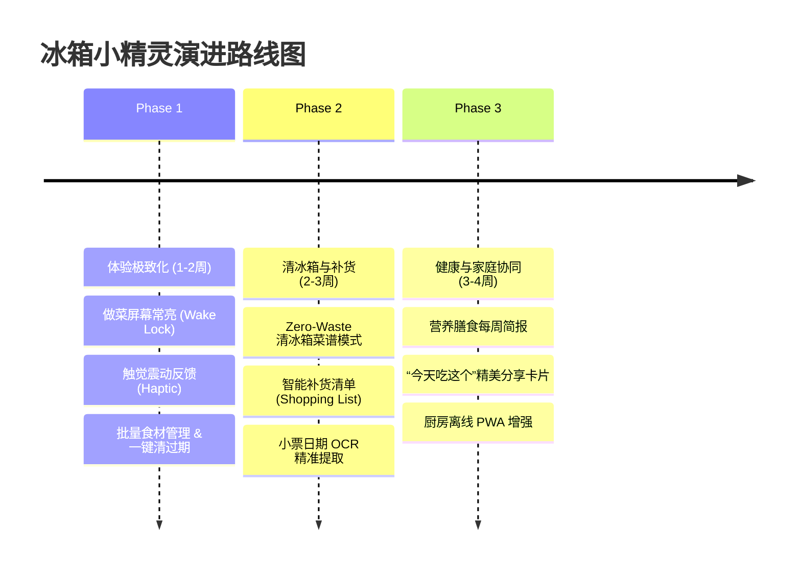

# 📋 冰箱小精灵 (Fridge Management) 优化与新功能演进报告

## 目录
1. **项目现状与核心优势回顾**
2. **体验与交互优化建议 (UX & Polish)**
3. **高价值新功能规划 (Feature Proposals)**
4. **AI 与多模态能力演进 (AI Capabilities)**
5. **架构与性能升级建议 (Engineering & Performance)**
6. **演进路线图推荐 (Roadmap)**

---

## 1. 项目现状与核心优势回顾

目前系统已具备极其完整且贴合移动端 ergonomics（人体工程学）的骨架：
- **库存与批次管理**：按临期/分类/位置筛选，支持“已开封/未开封”滑动切换及软删除。
- **多模态 AI 接入**：融合语音（FunASR / Whisper）与视觉（Qwen / GPT Vision），支持实物、发票清单自动识别及大模型增删改查。
- **智能“吃什么”与菜谱匹配**：结合剩余食材、用餐人数、时间段及下厨房真实 API/步骤补全，支持持久化推荐结果与离线看页做饭。
- **菜谱收藏与做饭指南**：全屏看页做饭视图，下厨房配料与图文步骤清晰展现，配备中下靠左悬浮返回浮钮。
- **移动端单手交互**：底栏 4-Tab 架构、中下靠左固定浮动 `← 返回` 按钮、触控按压缩放反馈、Dark/Light 高质感视效。

---

## 2. 体验与交互优化建议 (UX & Polish)

### 2.1 批量操作与高效管理 (Bulk Actions)
* **痛点**：目前食材批量采购入库（如超市买完菜）后，如果需要调整位置或删除，逐个点击编辑稍微繁琐。
* **优化建议**：
  - **批量选择模式**：长按任意食材行进入多选状态，支持“一键归为冷冻室”、“一键设为已开封”或“一键消耗”。
  - **智能一键“清空过期”**：在库存列表顶部增加“已过期食材”气泡，点击可一键将所有 `expired` 批次归档。

### 2.2 触觉与声音反馈 (Haptic & Audio Feedback)
* **优化建议**：
  - **iOS/Android 震动反馈 (Haptic Feedback)**：使用 `navigator.vibrate?.([10, 30])`，在按住语音录音、滑动切换开封状态、点击删除时提供细腻的轻微震动。
  - **语音打断与播报增强**：当小精灵正在语音播报时，点击语音球可立即中断朗读，并在播放时增加波纹水滴动画。

### 2.3 下厨房菜谱体验再升级
* **优化建议**：
  - **做菜模式“屏幕常亮 (Wake Lock API)”**：在全屏菜谱页面添加“做菜常亮”开关，防止用户手上有油/水时手机自动息屏。
  - **步骤语音控制 / 划压翻页**：看页做饭时，支持大字号步骤卡片横滑翻页，甚至喊“下一步”自动跳到下一项。

---

## 3. 高价值新功能规划 (Feature Proposals)

| 功能模块 | 功能名称 | 详细描述与价值 | 优先级 |
| :--- | :--- | :--- | :--- |
| **清冰箱大作战** | **Zero-Waste 盲盒菜谱** | 专门针对“3天内即将过期”的食材，一键生成高优先级“清冰箱组合菜”，最大化减少浪费。 | 🔥🔥🔥 高 |
| **补货与购物清单** | **Smart Replenishment** | 当常用食材（如蛋、奶、大米、调味品）消耗完或数量低于阈值时，自动归入“补货清单”，支持一键复制到微信备忘录或输出生成小票。 | 🔥🔥🔥 高 |
| **健康与营养盘点** | **Nutrition Insights** | 根据当周消耗的食材，AI 自动汇总“本周蔬菜/蛋白质摄入比例”，并提示“本周绿叶菜摄入偏少，建议补购”。 | 🔥🔥 中 |
| **社交与家庭分享** | **“今天吃这个！”精美卡片** | 选定推荐菜式后，一键生成小红书/微信朋友圈风格的精美美食卡片，或者给家庭成员发送通知“今晚吃【番茄牛肉】”。 | 🔥🔥 中 |
| **离线离网做饭** | **Offline Mode (PWA)** | 利用 Service Worker 离线缓存已收藏的菜谱图文与当前库存，在厨房信号差（如地下室/角落）时仍可流畅打开看页做饭。 | 🔥🔥 中 |

---

## 4. AI 与多模态能力演进 (AI Capabilities)

### 4.1 智能发票/小票多项拆解增强
* **升级点**：增加小票上的“生产日期/保质期”OCR 提取逻辑。例如小票上有“牛奶 2026-07-28”，AI 自动算出过期日并精准设定 `expiresAt`。

### 4.2 语音指令智能纠错与问答对话
* **升级点**：
  - **自然语言模糊查询**：“冰箱里还有能做汤的东西吗？”、“有没有适合小孩子吃的甜品？”
  - **增量语音改动确认**：“把刚才的牛肉改为 2 斤”或者“把刚才识别的香蕉去掉”。

---

## 5. 架构与性能升级建议 (Engineering & Performance)

### 5.1 图片上传前的 Web Worker 异步压缩
* **优化**：在遇到多张大图上传时，使用 OffscreenCanvas / Web Worker 异步处理，保持 UI 60fps 丝滑不卡顿。

### 5.2 数据库与持久化引擎（PocketBase / SQLite 方案）
* **优化**：随着家庭历史记录和菜谱收藏增长，后续可接入 PocketBase / SQLite 数据库，进一步提升万级历史日志的查询速度与备份安全性。

---

## 6. 演进路线图推荐 (Roadmap Recommendations)

