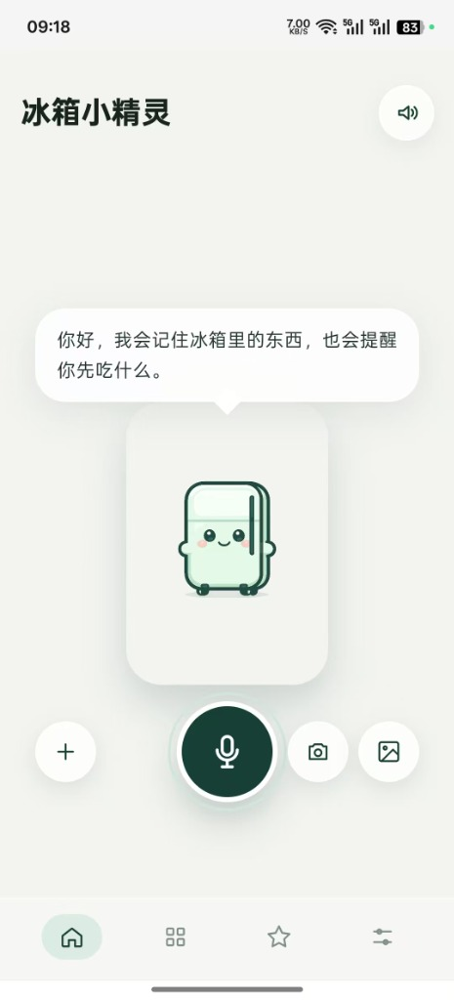
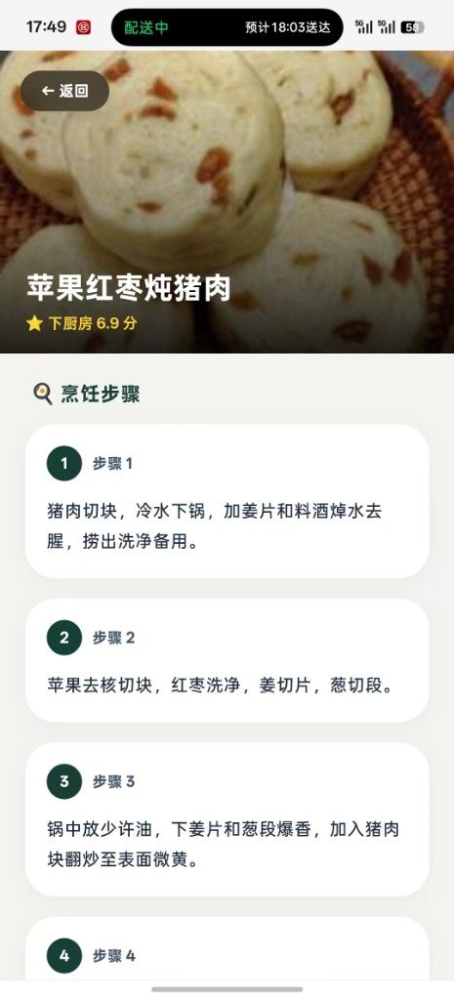

# 🧊 冰箱小精灵 (Fridge Management & Smart Recipe Agent)

> 基于多模态 AI（LLM + Vision AI + ASR 语音识别）与开源 HowToCook 菜谱生态的极简智能家庭冰箱管理与看页做饭助手。

[](https://nextjs.org/)
[](https://react.dev/)
[](https://www.typescriptlang.org/)
[](https://tailwindcss.com/)
[](https://www.docker.com/)

<p align="center">
  
  &nbsp;&nbsp;&nbsp;&nbsp;&nbsp;&nbsp;&nbsp;&nbsp;&nbsp;&nbsp;&nbsp;&nbsp;
  
</p>

---

## 🌟 核心亮点与特色

### 1. 🎤 交互式语音智能助手
- **按住说话 / 手势防误触**：支持长按触发语音识别，手机内滑动不出按钮区域不断断录音。
- **自然语言意图理解**：智能识别用户的增删改查指令（如 *“冰箱里放了2斤牛肉”*、*“把西红柿消耗掉1个”*、*“帮我看看有什么快过期的青菜”*），自动完成库存写库与操作日志记录。
- **语音朗读 (TTS)**：支持一键开启/关闭小精灵语音答复播报。

### 2. 📷 多模态视觉 & 购物小票识别
- **客户端自动图片压缩**：上传/拍照时自动通过 Canvas 压缩至 1920px JPEG，流畅兼容移动端相机 10MB+ 原图。
- **实物与发票/小票双重识别**：调用千问 Vision (Qwen-VL) 或 GPT-4o Vision，自动跳过日用品并提取食品名称、数量、单位。
- **中文命名与分类归一化**：自动将英文名（Milk → 牛奶）、非标准分类（生鲜蔬菜 → 蔬菜）规范化，避免模型幻觉丢项。
- **候选确认弹窗**：识别完成后弹出精致候选框，确认无误后一键入库。

### 3. 🍲 智能“吃什么”推荐与看页做饭指南
- **基于实效库存推荐**：综合冰箱现有剩余食材、用餐时间段（早/中/晚/夜宵）、就餐人数及个人饮食偏好（少油少盐、忌口等）生成定制菜谱。
- **开源菜谱深度融合**：内嵌 [HowToCook](https://github.com/Anduin2017/HowToCook)（Unlicense，无版权风险）菜谱索引，离线可用；缺失步骤由大模型补全。
- **做菜离线持久化与历史推荐**：推荐结果持久化到 LocalStorage，并提供独立的**全屏看页做饭**页面与收藏菜谱功能。

### 4. 📱 移动端 Ergonomics 人体工程学设计 (Apple Style)
- **单手操作最佳实践**：底部固定 4-Tab 导航（`今天` | `库存` | `吃什么` | `更多`）。
- **中下靠左固定悬浮 `← 返回` 浮钮**：所有全屏子页面（历史记录、菜谱收藏、看页做饭）均配备单手大拇指极佳触达的返回浮钮。
- **PWA 原生体验**：支持加到手机主屏幕、Service Worker 离线缓存与离线可用。

---

## 🚀 功能分布图

```
 ┌─────────────────────────────────────────────────────────────┐
 │                       冰箱小精灵 (PWA)                      │
 └──────┬──────────────┬──────────────┬──────────────┬─────────┘
        │              │              │              │
 ┌──────▼──────┐ ┌─────▼──────┐ ┌─────▼──────┐ ┌─────▼──────┐
 │    今天     │ │    库存    │ │   吃什么   │ │    更多    │
 ├─────────────┤ ├────────────┤ ├────────────┤ ├────────────┤
 │• 语音/文字  │ │• 按临期排序│ │• 智能菜谱  │ │• 收藏菜谱  │
 │  小精灵对话 │ │• 分类/位置 │ │  推荐卡片  │ │• 操作记录  │
 │• 拍照/小票  │ │• 滑动切换  │ │• HowToCook │ │• LLM供应商 │
 │  识别入库   │ │  开封状态  │ │  做菜步骤  │ │  配置管理  │
 └─────────────┘ └────────────┘ └────────────┘ └────────────┘
```

---

## 🛠️ 技术栈与架构设计

- **前端框架**：Next.js 16 (App Router) + React 19
- **样式与设计系统**：Tailwind CSS + Apple Fluid Motion 动画体系
- **数据持久化**：Better-SQLite3 本地轻量数据库 + LocalStorage 客户端缓存
- **语音识别 (ASR)**：本地 FunASR 服务 / OpenAI Whisper API
- **大模型 (LLM / Vision)**：通义千问 (Qwen-VL) / DeepSeek-Chat / OpenAI GPT-4o
- **容器与部署**：Docker / Docker Compose / Nginx 反向代理

---

## 📦 本地开发与构建指南

### 1. 环境准备
- Node.js >= 20.0.0
- pnpm >= 9.0.0

### 2. 安装依赖与启动
```bash
# 1. 克隆项目(含 HowToCook 菜谱 submodule)
git clone --recurse-submodules https://github.com/your-repo/bridge-management.git
cd bridge-management

# 若已克隆但未带 submodule,补一步初始化:
git submodule update --init --recursive

# 2. 安装依赖
pnpm install

# 3. 启动开发服务器
cd apps/web
pnpm dev
```
访问 [http://localhost:3000](http://localhost:3000) 即可开始体验。

### 3. 构建生产包
```bash
cd apps/web
pnpm build
pnpm start
```

> **菜谱数据源**：菜谱增强层基于开源项目 [HowToCook](https://github.com/Anduin2017/HowToCook)（Unlicense，无版权风险），以 git submodule 形式内嵌于 `apps/web/vendor/howtocook/`。开发（`predev`）与构建（`prebuild`）时会自动运行 `sync-howtocook.mjs`，把菜谱与图片同步到 `public/howtocook/` 供静态服务。

---

## 🐳 Docker 生产部署 (方案 A)

本项目采用**多容器架构**进行部署：
1. **`fridge-agent`**：Next.js Web 应用容器。
2. **`local-asr`**：Python ASR 语音识别容器（已打通 Silero VAD 与 FunASR Paraformer）。

为了保持 Docker 镜像的轻量与构建/拉取效率，我们采用 **Docker 数据卷缓存模型 (方案 A)** 的设计：
- 语音识别模型不打包在 Docker 镜像内部（镜像仅约 600MB，如果内置模型则会超过 2GB）。
- 首次启动容器时，`local-asr` 容器会自动从网络下载大约 1GB 的 Paraformer 中文语音识别模型与 Silero 人声检测模型。
- 下载的模型会持久化保存在 Docker 命名卷 `asr-models` 中。后续容器升级或重启时，会自动复用本地缓存，无需重新下载，实现秒级启动。

### 部署步骤

#### ⚡ 极简一键部署（适合全新服务器，无需克隆代码仓库）

在您的生产服务器上，新建一个空白目录并直接执行以下一键命令。它会自动下载 Compose 配置文件、在 `.env.production` 中自动生成高强度安全密钥，并启动容器：

```bash
# 1. 下载 Compose 文件，初始化环境文件并生成随机 APP_ENCRYPTION_KEY，随后后台运行
curl -sSL https://raw.githubusercontent.com/lulalulaluobo/bridge-management/main/docker-compose.production.yml -o docker-compose.yml \
  && printf "APP_ENCRYPTION_KEY=%s\nDEEPSEEK_API_KEY=在此填写你的DeepSeekKey\n" "$(openssl rand -base64 32)" > .env.production \
  && docker compose up -d
```

> [!TIP]
> 启动后，请执行 `nano .env.production`（或您常用的编辑器）将 `DEEPSEEK_API_KEY` 替换为您真实的大模型 Key，随后执行 `docker compose restart` 重启容器生效。

---

#### 🛠️ 常规部署步骤（克隆仓库模式）

1. **准备配置文件**：
   在项目根目录下准备 `.env.production` 文件，填写必要的环境变量（可参考 `.env.example`）：
   ```bash
   APP_ENCRYPTION_KEY=你的加密密钥
   DEEPSEEK_API_KEY=你的DeepSeek秘钥
   # ... 其他环境变量
   ```

2. **运行容器**：
   运行以下命令拉取最新镜像并后台启动：
   ```bash
   docker compose -f docker-compose.production.yml up -d
   ```

3. **启动验证**：
   - 首次启动后，使用 `docker compose -f docker-compose.production.yml logs -f local-asr` 查看语音识别服务日志，等待模型下载完成。
   - 待下载完成后，可以通过 `curl http://127.0.0.1:8787/health` 检查，若返回 `{"status":"ready"}` 说明语音服务已完全就绪。
   - Web 应用将在本地 `127.0.0.1:3001` 端口提供服务。

4. **Nginx 反向代理**：
   推荐在宿主机上配置 Nginx 进行反向代理并配置 HTTPS 证书（可以参考 [deploy/nginx/bridge.lucc.fun.conf](file:///Users/luluen/ai-project/bridge-management/deploy/nginx/bridge.lucc.fun.conf)），代理至 `http://127.0.0.1:3001` 即可。

---

## ⚙️ 模型供应商配置

在应用内点击 **更多** → **模型设置**，支持配置以下 LLM 供应商：
1. **千问 (Qwen-VL)**（推荐，完美支持多模态拍照识别与高性价比对话）
2. **DeepSeek-Chat**（适合纯文本对话与智能意图路由）
3. **OpenAI (GPT-4o / GPT-4o-mini)**
4. **自定义 OpenAI 兼容 API**（OpenRouter / Groq / Ollama 等）

---

## 📄 许可证

[MIT License](LICENSE)
